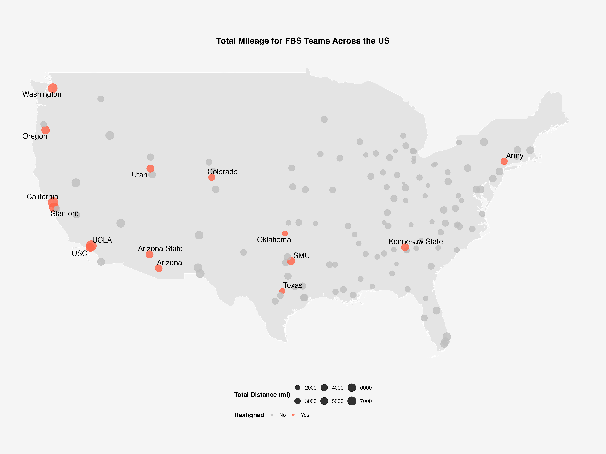
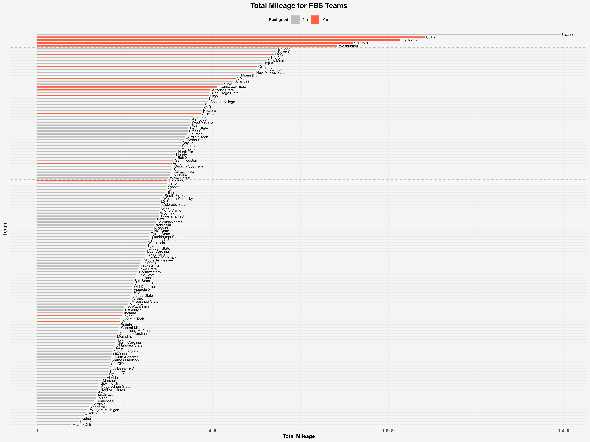

```{r setup, include=FALSE, message=FALSE, results='hide', warning=FALSE}
knitr::opts_chunk$set(echo = FALSE)
```

## Recap

- Realinged teams have highest travel rates

- No specific conference schools transfered to 

- 111,247 CO2e/kg averge per realinged team 
    - Highest by a large margin

## Schools

{width="850"}

## Realinged Schools

{width="850"}

## Chloropleth

{width="850"}

## Count of Schools

{width="850"}

