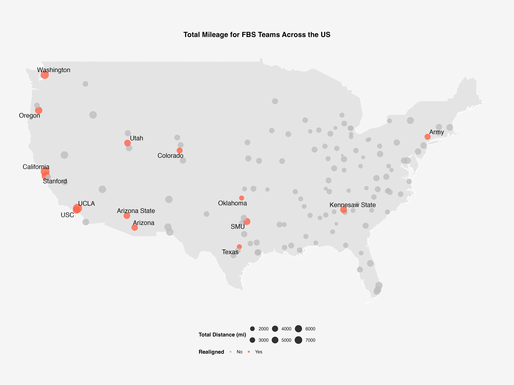
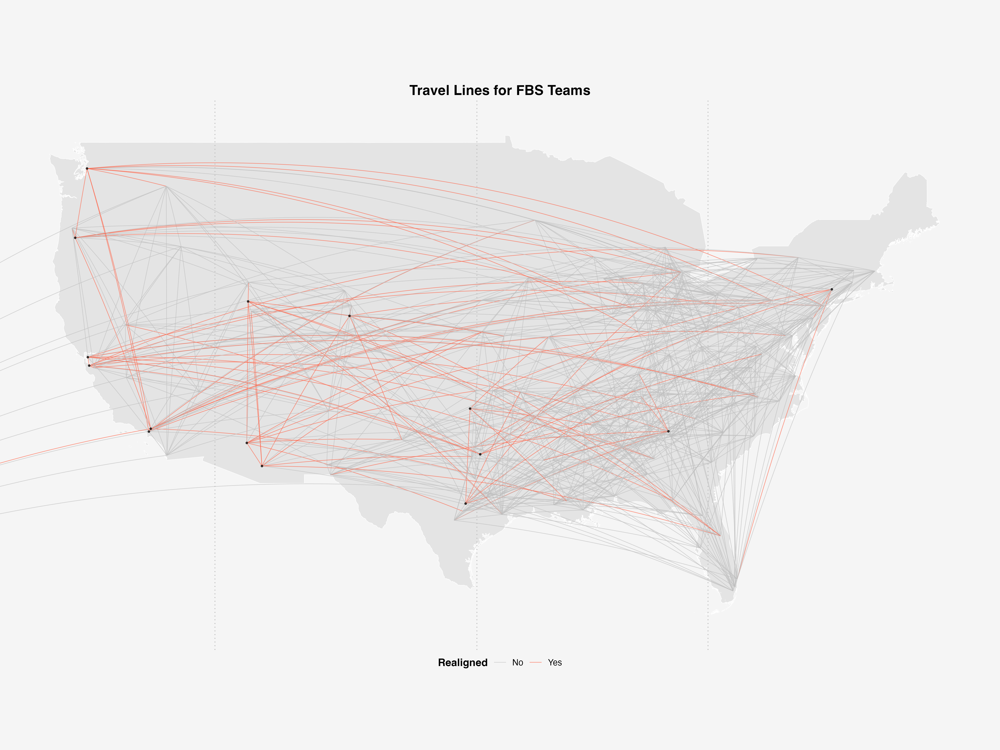
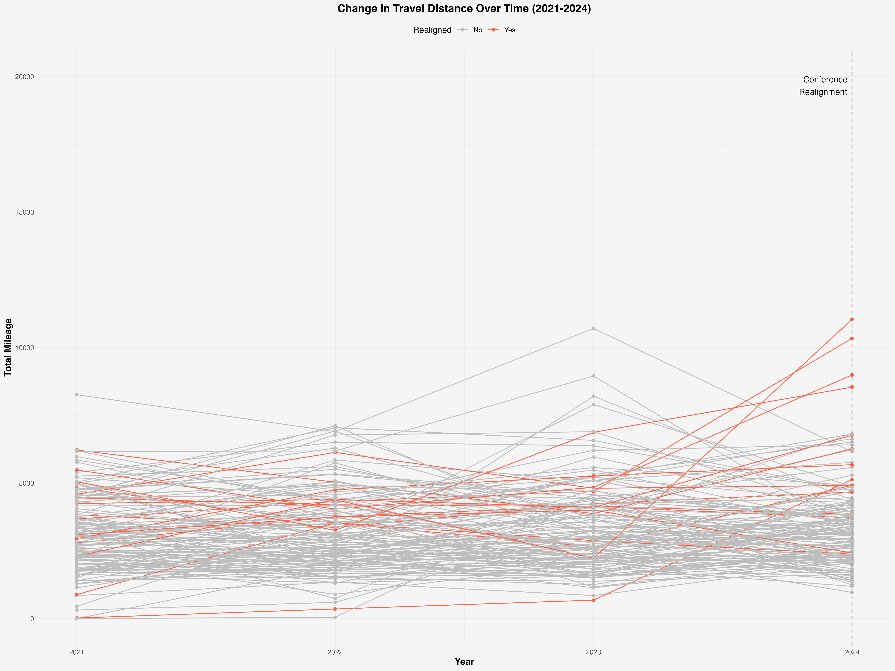

```{r setup, include=FALSE, message=FALSE, results='hide', warning=FALSE}
knitr::opts_chunk$set(echo = FALSE)
```
```{r, message=FALSE, warning=FALSE}
# nolint start
library(readr)
library(dplyr)
library(tidyverse)
library(geosphere)
library(ggplot2)
library(giscoR)
library(ggrepel)
library(ggridges)
library(flextable)
source("./R/functions.r")

realinged_teams <- c("California", "SMU", "Stanford", "USC", "UCLA", "Washington", "Oregon", "Arizona", "Arizona State", "Utah", "Colorado", "Army", "Texas", "Kennesaw State", "Oklahoma")

fbs_list <- read_csv("./data/FBS_list.csv") %>%
    rename(conference = `Current\r\nConference`) %>%
    select(School, conference) %>%
    mutate(School = recode(School, "Louisiana–Monroe" = "Louisiana-Monroe"))

stadiums <- read_csv("./data/stadiums-geocoded.csv") %>%
    select(team, capacity, div, latitude, longitude) %>%
    filter(div == "fbs" & team != "Idaho") %>%
    add_row(team = "Coastal Carolina", capacity = 21000, div = "fbs", latitude = 33.7930, longitude = -79.0177) %>%
    add_row(team = "Jacksonville State", capacity = 24000, div = "fbs", latitude = 33.8203, longitude = -85.7664) %>%
    add_row(team = "James Madison", capacity = 25000, div = "fbs", latitude = 38.4344, longitude = -78.8704) %>%
    add_row(team = "Kennesaw State", capacity = 10200, div = "fbs", latitude = 34.0290, longitude = -84.5676) %>%
    add_row(team = "Liberty", capacity = 25000, div = "fbs", latitude = 37.3523, longitude = -79.1716) %>%
    add_row(team = "Sam Houston", capacity = 14000, div = "fbs", latitude = 30.7083, longitude = -95.5383) %>%
    add_row(team = "UAB", capacity = 47100, div = "fbs", latitude = 33.4971, longitude = -86.8121) %>%
    mutate(team = recode(team,
        "Louisiana-Lafayette" = "Louisiana",
        "Connecticut" = "UConn",
        "Louisiana-Monroe" = "Louisiana-Monroe",
        "Miami" = "Miami (FL)",
        "NIU" = "Northern Illinois",
        "Mississippi" = "Ole Miss",
        "USF" = "South Florida",
        "Southern California" = "USC"
    ))

teams <- stadiums %>%
    left_join(fbs_list, by = c("team" = "School"))

dat_2024 <- clean(read_csv("./data/2024_schedule.csv") %>% rename_all(tolower), stadiums)

schedules <- list(
    "2024" = dat_2024
)

teams <- get_distance("2024", teams)

# conf_mileage <- teams %>%
#     group_by(conference) %>%
#     summarise(total_mileage = sum(total_mileage_2024))

teams <- teams %>%
    mutate(realigned = ifelse(team %in% realinged_teams, TRUE, FALSE))

# conf_and_realigned <- bind_rows(teams %>% filter(!realigned & conference != "Pac-12"), teams %>% filter(realigned) %>% mutate(conference = "Realigned"))

# conf_and_realigned_emissions <- teams %>%
#     filter(!realigned) %>%
#     group_by(conference) %>%
#     summarise(emissions = round(sum(total_mileage_2024) * 0.17 / n(), digits = 2))

# realigned_emissions <- teams %>%
#     filter(realigned) %>%
#     summarise(conference = "Realigned", emissions = round(sum(total_mileage_2024) * 0.17 / nrow(filter(teams, realigned)), digits = 2))

# conf_and_realigned_emissions <- bind_rows(conf_and_realigned_emissions, realigned_emissions)
```
## Map of FBS Teams

{width="750"}

## Data Chart

```{r}
conf_and_realigned_miles <- teams %>%
    filter(!realigned) %>%
    group_by(conference) %>%
    summarise(
        mileage = round(sum(total_mileage_2024) / n(), digits = 0),
        bus_mileage = round(sum(bus_mileage_2024) / n(), digits = 0),
        plane_mileage = round(sum(plane_mileage_2024) / n(), digits = 0)
    )

realigned_emissions2 <- teams %>%
    filter(realigned) %>%
    summarise(
        conference = "Realigned",
        mileage = round(sum(total_mileage_2024) / nrow(filter(teams, realigned)), digits = 0),
        bus_mileage = round(sum(bus_mileage_2024) / nrow(filter(teams, realigned)), digits = 0),
        plane_mileage = round(sum(plane_mileage_2024) / nrow(filter(teams, realigned)), digits = 0)
    )

conf_and_realigned_data <- bind_rows(conf_and_realigned_miles, realigned_emissions2) %>%
    mutate(emissions = (bus_mileage * 3) + (plane_mileage * 19))

table_data <- conf_and_realigned_data %>%
    pivot_longer(cols = c(mileage, bus_mileage, plane_mileage, emissions), names_to = "type", values_to = "value") %>%
    pivot_wider(names_from = conference, values_from = value) %>%
    mutate(type = recode(type, "mileage" = "Total Mileage", "bus_mileage" = "Bus Mileage", "plane_mileage" = "Plane Mileage", "emissions" = "Emissions (kg)")) %>%
    mutate(across(where(is.numeric), ~ round(., 2)))

ft <- flextable(table_data) %>%
    theme_alafoli() %>%
    fontsize(size = 8, part = "all") %>%
    autofit() %>%
    bold(part = "header") %>%
    bg(j = "Realigned", bg = "#D3D3D3", part = "body") %>%
    color(j = "Realigned", color = "red", part = "body") %>%
    set_header_labels(type = "Metric")

ft
```
<br></br>

- Realinged teams have highest mileage per school — 5,973mi

- Realigned teams have highest emissions per school — 111,247 CO2e/kg

- Realigned teams have highest plane mileage per school and lowest bus mileage per school

## Travel Map

{width="750"}

## Mileage over 2021-2024

{width="750"}

## Futher Exploration

- **Costs** - How much does travel cost each school? Has Realigned Affected This?

- **Solution** - Could another realignment of conferences reduce emissions and costs?

## Sources

**Sports Reference**
     *College Football Schedules 2021-2024*

**Wikipedia**
     *Location Data of FBS Schools*