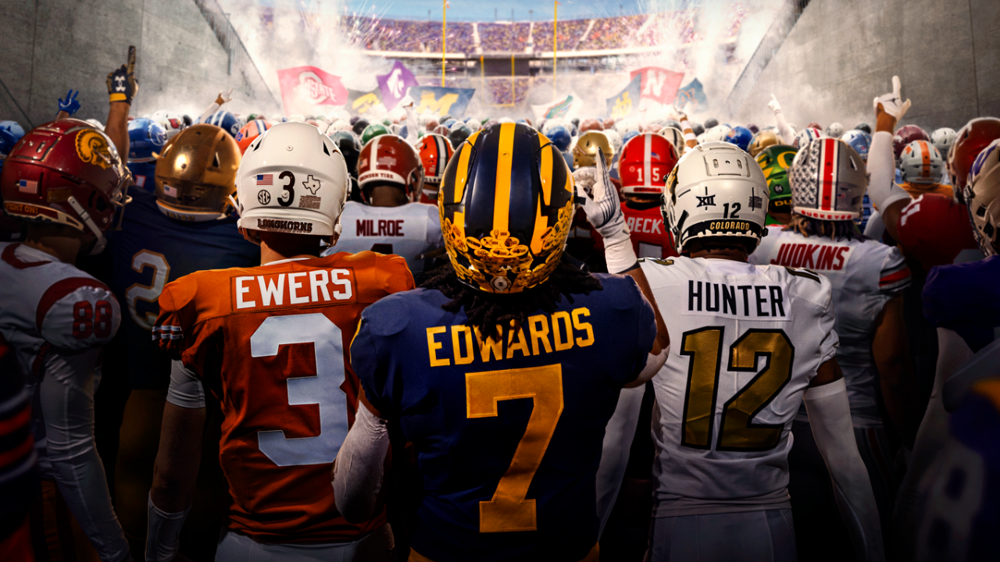

```{r setup, include=FALSE}
knitr::opts_chunk$set(echo = FALSE)
knitr::opts_chunk$set(cache = FALSE)
knitr::opts_chunk$set(fig.align = "center")
knitr::opts_chunk$set(warning = FALSE, message = FALSE)
```
```{r prework, message=FALSE, warning=FALSE}
#nolint start
library(showtext)
library(readr)
library(dplyr)
library(officer)
library(tidyverse)
library(geosphere)
library(ggplot2)
library(giscoR)
library(ggrepel)
library(ggridges)
library(flextable)
library(patchwork)
library(gdtools)
source("../R/functions.r")

realinged_teams <- c("California", "SMU", "Stanford", "USC", "UCLA", "Washington", "Oregon", "Arizona", "Arizona State", "Utah", "Colorado", "Army", "Texas", "Kennesaw State", "Oklahoma")

## Gets US Map
US <- gisco_get_countries(country = "US", resolution = "1")

## Assings Time Zone variable
time_zones <- data.frame(
  lon = c(-82, -97, -114),
  label = c("Central", "Mountain", "Pacific")
)

theme_elsevier <- function() {
  theme_minimal(base_size = 12, base_family = "serif") +
    theme(
      panel.border = element_rect(color = "black", fill = NA, size = 0.5),
      panel.grid.minor = element_blank(),
      axis.title = element_text(size = 14, face = "bold"),
      axis.text = element_text(size = 12),
      legend.title = element_text(size = 12, face = "bold"),
      legend.text = element_text(size = 10),
      legend.position = "top",
      plot.title = element_text(size = 16, face = "bold", hjust = 0.5),
      plot.subtitle = element_text(size = 14, hjust = 0.5),
      plot.margin = margin(10, 10, 10, 10)
    )
}

## Breakpoints for circles
breakpoints <- c(2000, 3000, 4000, 5000, 6000, 7000)

fbs_list <- read_csv("../data/FBS_list.csv") %>%
  rename(conference = `Current\r\nConference`) %>%
  select(School, conference) %>%
  mutate(School = recode(School, "Louisiana–Monroe" = "Louisiana-Monroe"))

stadiums <- read_csv("../data/stadiums-geocoded.csv") %>%
  select(team, capacity, div, latitude, longitude, state) %>%
  filter(div == "fbs" & team != "Idaho") %>%
  add_row(team = "Coastal Carolina", capacity = 21000, div = "fbs", latitude = 33.7930, longitude = -79.0177) %>%
  add_row(team = "Jacksonville State", capacity = 24000, div = "fbs", latitude = 33.8203, longitude = -85.7664) %>%
  add_row(team = "James Madison", capacity = 25000, div = "fbs", latitude = 38.4344, longitude = -78.8704) %>%
  add_row(team = "Kennesaw State", capacity = 10200, div = "fbs", latitude = 34.0290, longitude = -84.5676) %>%
  add_row(team = "Liberty", capacity = 25000, div = "fbs", latitude = 37.3523, longitude = -79.1716) %>%
  add_row(team = "Sam Houston", capacity = 14000, div = "fbs", latitude = 30.7083, longitude = -95.5383) %>%
  add_row(team = "UAB", capacity = 47100, div = "fbs", latitude = 33.4971, longitude = -86.8121) %>%
  mutate(team = recode(team,
    "Louisiana-Lafayette" = "Louisiana",
    "Connecticut" = "UConn",
    "Louisiana-Monroe" = "Louisiana-Monroe",
    "Miami" = "Miami (FL)",
    "NIU" = "Northern Illinois",
    "Mississippi" = "Ole Miss",
    "USF" = "South Florida",
    "Southern California" = "USC"
  ))

teams <- stadiums %>%
  left_join(fbs_list, by = c("team" = "School"))

dat_2021 <- clean(read_csv("../data/2021_schedule.csv") %>% rename_all(tolower), stadiums)
dat_2022 <- clean(read_csv("../data/2022_schedule.csv") %>% rename_all(tolower), stadiums)
dat_2023 <- clean(read_csv("../data/2023_schedule.csv") %>% rename_all(tolower), stadiums)
dat_2024 <- clean(read_csv("../data/2024_schedule.csv") %>% rename_all(tolower), stadiums)

schedules <- list(
  "2021" = dat_2021,
  "2022" = dat_2022,
  "2023" = dat_2023,
  "2024" = dat_2024
)

## Gets Great Circle lines for 2024
lines <- gc(dat_2024, teams, realinged_teams)

## Calculates distances for each year
teams <- get_distance("2021", teams)
teams <- get_distance("2022", teams)
teams <- get_distance("2023", teams)
teams <- get_distance("2024", teams)

## Adds T/f variable for realinged
teams <- teams %>%
  mutate(realigned = ifelse(team %in% realinged_teams, TRUE, FALSE))

## Pivots teams to make usable for table
teams_long <- teams %>%
  select(team, total_mileage_2021, total_mileage_2022, total_mileage_2023, total_mileage_2024, realigned) %>%
  pivot_longer(
    cols = starts_with("total_mileage"),
    names_to = "year",
    values_to = "mileage"
  ) %>%
  mutate(year = as.numeric(str_extract(year, "\\d{4}")))

## Creates mileage data
conf_and_realigned_miles <- teams %>%
  filter(!realigned) %>%
  group_by(conference) %>%
  summarise(mileage = round(sum(total_mileage_2024) / n(), digits = 0), bus_mileage = round(sum(bus_mileage_2024) / n(), digits = 0), plane_mileage = round(sum(plane_mileage_2024) / n(), digits = 0))

## creates realinged mileage data
realigned_emissions2 <- teams %>%
  filter(realigned) %>%
  summarise(conference = "Realigned", mileage = round(sum(total_mileage_2024) / nrow(filter(teams, realigned)), digits = 0), bus_mileage = round(sum(bus_mileage_2024) / nrow(filter(teams, realigned)), digits = 0), plane_mileage = round(sum(plane_mileage_2024) / nrow(filter(teams, realigned)), digits = 0))

## binds data and calcs emisions
cr_data <- bind_rows(conf_and_realigned_miles, realigned_emissions2) %>%
  mutate(emissions = (bus_mileage * 3) + (plane_mileage * 19))

## makes data long
cr_data_long <- cr_data %>%
  select(-mileage) %>%
  rename(Bus = bus_mileage, Plane = plane_mileage) %>%
  pivot_longer(
    cols = c(Plane, Bus),
    names_to = "type",
    values_to = "value"
  ) %>%
  mutate(measurement = "\u200BMileage")

cr_data_long <- bind_rows(cr_data_long, cr_data_long %>% mutate(measurement = "Emissions (10kg)", value = (value * ifelse(type == "Bus", 3, 19)) / 10))

cr_data_long <- cr_data_long %>%
  mutate(conference = factor(conference, levels = unique(cr_data_long$conference[order(cr_data_long$value[cr_data_long$measurement == "Emissions (10kg)"], decreasing = TRUE)]))) %>%
  mutate(type_realinged = paste(type, ifelse(conference == "Realigned", "Realigned", "Not Realigned"), sep = "-"))

table_data <- cr_data %>%
  pivot_longer(cols = c(mileage, bus_mileage, plane_mileage, emissions), names_to = "type", values_to = "value") %>%
  pivot_wider(names_from = conference, values_from = value) %>%
  mutate(type = recode(type, "mileage" = "Total Mileage", "bus_mileage" = "Bus Mileage", "plane_mileage" = "Plane Mileage", "emissions" = "Emissions (kg)"))

table_data <- table_data %>%
  mutate(across(where(is.numeric), ~ round(., 2)))

realinged_count <- stadiums %>%
  filter(team %in% realinged_teams) %>%
  group_by(state) %>%
  summarise(count = n())

state_data <- map_data("state") %>%
  mutate(region = state.abb[match(region, tolower(state.name))]) %>%
  left_join(realinged_count, by = c("region" = "state"))
```

## Introduction

- 134 FBS Division I FBS schools

- 15 teams realigned this year

- Realignment impacts:
    - **Increased** travel distances.
    - Significant **environmental costs**.
    - Prioritization of **financial gains over tradition**

----

```{r fig2, fig.width = 5, fig.pos="H", fig.height = 3, fig.align='center', dpi = 500, fig.cap = "\\label{fig2}FBS Schools Across the US.", echo = FALSE}

p2 <- ggplot() +
  geom_sf(data = US, fill = "lightgrey", color = "white", alpha = 0.5) +
  geom_point(data = teams, aes(x = longitude, y = latitude, color = realigned), alpha = 0.8) +
  theme_void() +
  coord_sf(xlim = c(-125, -66), ylim = c(24, 50)) +
  scale_size_continuous(name = "Total Distance (mi)", breaks = breakpoints, range = c(2, 10)) +
  labs(y = element_blank(), x = element_blank(), caption = "Not Pictured: Hawaii") +
  scale_color_manual(values = c(`TRUE` = "#FF6347", `FALSE` = "grey"), name = "Realigned", labels = c("No", "Yes")) +
  theme(
    plot.title = element_text(size = 16, face = "bold", hjust = 0.5),
    legend.position = "bottom",
    legend.title = element_text(size = 12, face = "bold"),
    legend.text = element_text(size = 10),
    legend.box = "vertical",
    legend.box.just = "left",
    panel.background = element_rect(fill = "white", color = NA),
    plot.background = element_rect(fill = "white", color = NA),
    panel.grid = element_blank(),
    axis.title = element_blank(),
    axis.text = element_blank(),
  ) +
  geom_text_repel(
    data = teams %>% filter(realigned), aes(x = longitude, y = latitude, label = team), size = 2,
    box.padding = 0.35, point.padding = 0.5, segment.color = "grey50"
  )

p2
```

## Key Facts

- 3,500 - 4,000 miles on average for FBS teams

- 600-700 tons of CO2 emissions per year

- Media rights revenue: 28% of a teams total revenue

<div style="text-align: center; margin-top: 20px;">
  
</div>

# Background

## Beginings

- **Conference Realignment** is the process by which college athletic programs change the conference they compete in.

    - Has historically been driven by geographic, financial and competitive factors.

    - Commonly between FBS (Football Bowl Subdivision)

    - Occasioanlly between FCS (Football Championship Subdivision)
    
    - Rarely DII/DIII

--

- Prelude to 2024-2025 historically prolific

    - 15 teams realigned

    - Cal, SMU, Army, Standford, USC, UCLA, Washington, Oregon
    - Arizona, Arizona State, Utah, Colorado, Texas, Kennesaw State, Oklahoma

## Fall of the Pac-12

- UCLA and USC -> Big 10 in 2024

- Media Rights controversy

    - Heavy delays in negotiations

        - Colorado -> Big 12 due to delays

    - Oregon backed deal with Apple TV
    
        - Raised questions due to lack of televised content

        - Washington inform Pac12 of move to Big 12 10 minuets before media deal meeting

        - Chain reaction sent ASU, Arizona and Utah to Big 12

        - Oregon -> Big 12

## Individual Schools
- Army
    
    - Independent
    
    - Joined AAC

- SMU, Cal, Standford

    - Joined ACC

    - Extreme travel distance (West Coast to East Coast)

- Kennesaw State

    - Reclasified to FBS from FCS

    - Joined Sun Belt

- Texas, Oklahoma
    
    - Joined SEC
    
    - Major financial influence

----

```{r fig7, fig.width = 5, fig.pos = "H", fig.height = 3, dpi = 500, fig.align='center', fig.cap = "\\label{fig3}Count of Realigned Schools per State", echo = FALSE}
p6 <- ggplot(state_data, aes(map_id = region)) +
  geom_map(aes(fill = count), map = state_data) +
  coord_sf(xlim = c(-125, -66), ylim = c(24, 50)) +
  scale_fill_continuous(low = "#ffb5a8", high = "#FF6347", na.value = "grey") +
  theme_void() +
  labs(fill = "Count") +
  theme(
    plot.title = element_text(size = 16, face = "bold", hjust = 0.5),
    legend.position = "bottom",
    legend.title = element_blank(),
    legend.text = element_text(size = 10),
    panel.background = element_rect(fill = "white", color = NA),
    plot.background = element_rect(fill = "white", color = NA)
  )

p6
```

----

```{r fig3, fig.width = 5, fig.pos = "H", fig.height = 3, dpi = 500, fig.align='center', fig.cap = "\\label{fig3}FBS Schools Across the US.", echo = FALSE}
p5 <- ggplot() +
  geom_sf(data = US, fill = "lightgray", color = "white", alpha = 0.5) +
  geom_path(data = lines, aes(x = lon, y = lat, group = id, color = realinged), size = 0.3, alpha = 0.7) +
  geom_point(data = stadiums %>% filter(team %in% realinged_teams), aes(x = longitude, y = latitude), size = 0.7, alpha = 0.7) +
  geom_vline(data = time_zones, aes(xintercept = lon), linetype = "dotted", color = "grey") +
  theme_void() +
  coord_sf(xlim = c(-125, -66), ylim = c(24, 50)) +
  scale_color_manual(values = c(`TRUE` = "#FF6347", `FALSE` = "grey"), name = "Realigned", labels = c("No", "Yes")) +
  theme(
    panel.background = element_rect(fill = "white", color = NA),
    plot.background = element_rect(fill = "white", color = NA)
  )
p5
```

# Findings

## Methodology

- Season master schedules from 2021 through 2024

- Calculated mileage for each teams away games (4-7 games per year)

    - Utalized Great Circle Haversine formula 
        - Accounts for curvature of the earth

- Calculated emissions for each team

    - Seperated by bus and plane travel

        - Cutoff estimated at 350 miles 

    - Bus: 3 kg CO2 per mile

    - Plane: 19 kg CO2 per mile

&nbsp;

---- 

```{r fig1, fig.width = 3, fig.pos = "H", fig.height = 2, dpi = 500, fig.align='center', fig.cap = "\\label{fig1}Total Mileage for FBS Teams", echo = FALSE}

theme_quad <- function() {
  theme_minimal(base_size = 12, base_family = "serif") +
    theme(
      panel.border = element_rect(color = "black", fill = NA, size = 0.5),
      panel.grid.minor = element_blank(),
      legend.position = "none",
      axis.text = element_blank(),
      axis.title = element_text(size = 6, face = "bold"),
    )
}

p <- ggplot() +
  geom_col(data = teams, aes(x = reorder(team, total_mileage_2024), y = total_mileage_2024, fill = realigned), width = 0.4) +
  scale_fill_manual(values = c(`TRUE` = "#FF6347", `FALSE` = "grey"), name = "Realigned", labels = c("No", "Yes")) +
  theme_quad() +
  labs(x = element_blank(), y = "2024") +
  coord_flip() 

p3 <- ggplot() +
  geom_col(data = teams, aes(x = reorder(team, total_mileage_2023), y = total_mileage_2023, fill = realigned), width = 0.4) +
  scale_fill_manual(values = c(`TRUE` = "#FF6347", `FALSE` = "grey")) +
  theme_quad() +
  labs(x = element_blank(), y = "2023") +
  coord_flip()

p4 <- ggplot() +
  geom_col(data = teams, aes(x = reorder(team, total_mileage_2022), y = total_mileage_2022, fill = realigned), width = 0.4) +
  scale_fill_manual(values = c(`TRUE` = "#FF6347", `FALSE` = "grey")) +
  theme_quad() +
  labs(x = element_blank(), y = "2022") +
  coord_flip() 

p5 <- ggplot() +
  geom_col(data = teams, aes(x = reorder(team, total_mileage_2021), y = total_mileage_2021, fill = realigned), width = 0.4) +
  scale_fill_manual(values = c(`TRUE` = "#FF6347", `FALSE` = "grey")) +
  theme_quad() +
  labs(x = element_blank(), y = "2021") +
  coord_flip()

combined = (p5 | p4) / (p3 | p)

combined
```

----

- Average mileage per team: 3,500 - 4,000 miles

- Average emissions per team: 600-700 tons of CO2

- Average mileage for realigned teams: 5,000 - 6,000 miles

- Average emissions for realigned teams: 1,000 - 1,200 tons of CO2

```{r tbl1, fig.pos = "H", dpi = 500, fig.align='right', fig.cap = "Table 1 Mileage and Emissions by Conference", echo = FALSE, fig.margin = c(-5, 0, 0, 0)}
ft1 <- flextable(table_data) %>%
  theme_vanilla() %>%
  fontsize(size = 6.5, part = "all") %>%
  # autofit() %>%
  bold(part = "header") %>%
  align(align = "center", part = "all") %>%
  border_remove() %>%
  border_outer(border = fp_border(width = 1)) %>%
  border_inner_h(border = fp_border(width = 0.5)) %>%
  width(j = 1:3, width = .25) %>%
  height_all(height = 0.15) %>%
  bg(j = "Realigned", bg = "gray", part = "body") %>%
  color(j = "Realigned", color = "black", part = "body") %>%
  set_header_labels(Realigned = "Realigned Metric")

ft1
```

# Solution

## Adjusted Conference Realignment

- Solution

    - Adjust conferences to allign to factor

        - Geographic Region

        - Financial Stability
        
        - Competitive Balance

        - Rivalries

        - Tradition

    - Limitations

        - Not perfect

        - Pipe dream with out change in NCAA

---- 

```{r fig6, fig.width = 5, fig.pos = "H", fig.height = 3, dpi = 500, fig.cap = "\\label{fig6}FBS Schools Reconferenced", echo = FALSE}

conferences <- list(
  pac12 = c("California", "Oregon", "Oregon State", "Stanford", "UCLA", "USC", "Washington", "Washington State", "San Jose State", "San Diego State", "Fresno State", "Nevada"),
  big10 = c("Arizona", "Arizona State", "UNLV", "Utah", "BYU", "Utah State", "Boise State", "Colorado", "Colorado State", "Wyoming", "Air Force"),
  neac = c("Boston College", "Syracuse", "UMass", "UConn", "Army", "Rutgers", "Temple", "Navy", "Buffalo"),
  acc = c("Virginia", "Virginia Tech", "Duke", "North Carolina", "NC State", "Clemson", "Maryland", "Wake Forest", "Georgia Tech", "Pittsburgh", "Louisville"),
  big12 = c("Penn State", "Ohio State", "Michigan", "Michigan State", "Indiana", "Notre Dame", "Purdue", "Illinois", "Miami (OH)", "Cincinnati", "West Virginia", "Ohio"),
  ecac = c("James Madison", "Liberty", "Old Dominion", "East Carolina", "Appalachian State", "Charlotte", "Coastal Carolina", "Georgia Southern", "Georgia State", "Kennesaw State"),
  sec = c("Alabama", "Auburn", "LSU", "Ole Miss", "Mississippi State", "Arkansas", "Tennessee", "Florida State", "Florida", "Georgia", "Kentucky", "South Carolina", "Miami (FL)", "Louisiana"),
  gcac = c("Tulane", "FIU", "Louisiana-Monroe", "Louisiana Tech", "South Alabama", "Troy", "UAB", "Jacksonville State", "Memphis", "South Florida", "UCF", "Southern Miss", "Florida Atlantic"),
  tac = c("Texas", "TCU", "Texas Tech", "SMU", "Baylor", "Houston", "Texas State", "UTSA", "UTEP", "North Texas", "Texas A&M", "New Mexico", "New Mexico State", "Rice", "Sam Houston"),
  meac = c("Vanderbilt", "Middle Tennessee", "Kent State", "Akron", "Bowling Green", "Toledo", "Eastern Michigan", "Western Michigan", "Central Michigan", "Northern Illinois", "Ball State", "Marshall", "Western Kentucky"),
  mwac = c("Iowa", "Iowa State", "Minnesota", "Wisconsin", "Northwestern", "Nebraska", "Kansas", "Kansas State", "Missouri", "Oklahoma", "Oklahoma State", "Tulsa", "Arkansas State")
)

schoool <- do.call(rbind, lapply(names(conferences), function(conf) {
  data.frame(team = conferences[[conf]], new_conference = conf, stringsAsFactors = FALSE)
}))

teams <- teams %>% left_join(schoool, by = "team")

p7 <- ggplot() +
  geom_sf(data = US, fill = "lightgrey", color = "white", alpha = 0.5) +
  geom_point(data = teams, aes(x = longitude, y = latitude, color = new_conference), alpha = 0.8) +
  theme_void() +
  coord_sf(xlim = c(-125, -66), ylim = c(24, 50)) +
  labs(y = element_blank(), x = element_blank(), caption = "Not Pictured: Hawaii") +
  theme_elsevier() +
  theme(
    panel.grid = element_blank(),
    axis.title = element_blank(),
    axis.text = element_blank(),
    plot.margin = margin(10, 10, 10, 0),
    legend.position = "none"
  )

p7
```

## Conclusion

College Football, considered one of America's most famous pastimes, has so much to be proud of. Transforming young men into strong, confident, men ready for the real world — whether NFL or elsewhere — is a system built for good. 

When utilized as a business, rather than the culture that it is derives from where the sport came from in the first place. A group of boys looking to represent their school, and fight for something bigger. 

Now, it is time for others to fight for something bigger; a fight for climate awareness. While college football is not the sole cause of the climate crisis, the sport has an enormous platform for change that we have seen utilized in the past. To set an example for other sports or organizations helps bleed the mission into other forms of life and culture, hopefully leading to a better future for us and our children.

