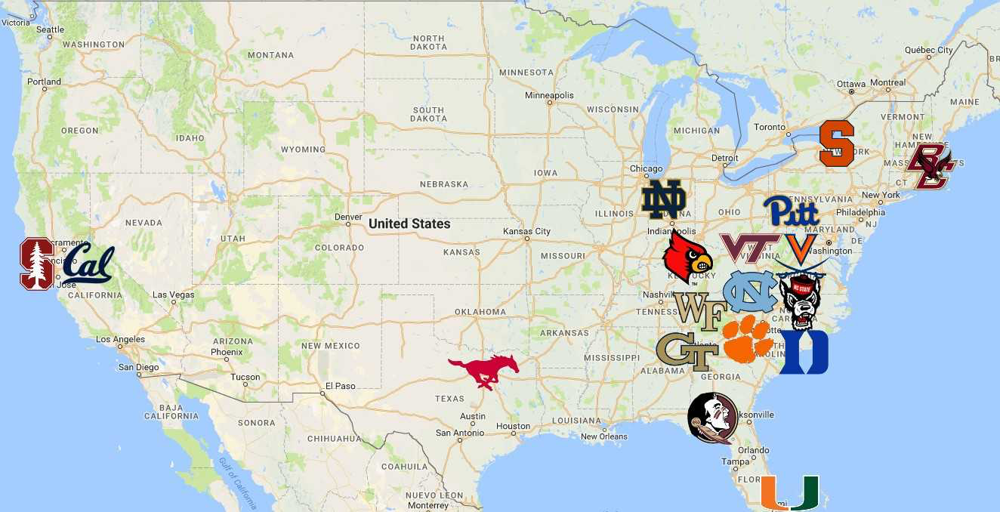

```{r setup, include=FALSE}
knitr::opts_chunk$set(echo = FALSE)
```

# Key Focus Area

## College Sports Realignment

-   Changing of athletic conferences

-   SEC, Big 10, ACC, Pac-12

-   Affect on players, teams, and schools

    {width="568"}

## Topics

-   Recruitment Changes

-   Injury Rates

-   Academic Impact

{width="616"}

## Data Sources

-   NCAA Records, team win-loss, athletic schedules

-   ESPN, 247sports, Rivals

-   Sports Reference, NFL