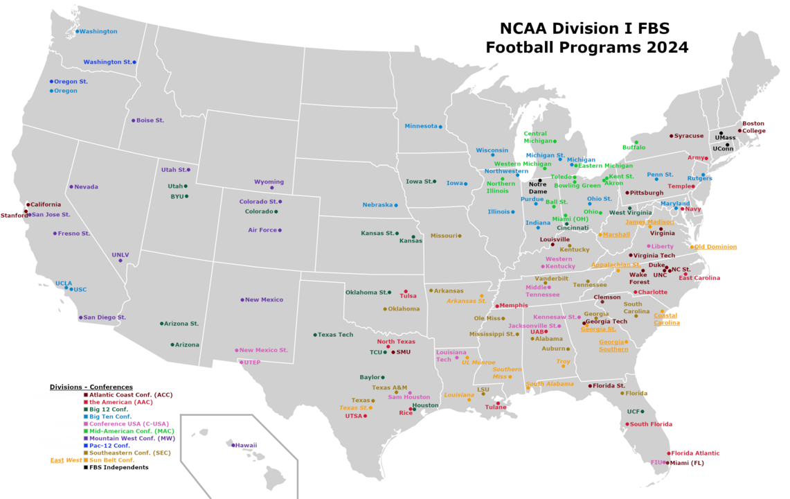

# How has College Football Realignment Affected Travel?

## Context

{width="600"}
  
134 FBS Schools in 10 Conferences

Conference Realignment craze in 2010s

## Football Travel

- Teams can travel with 70 players - ESPN & NCAA Bylaws

- Busses, Charter and Commercial Flights

- 6-8 Away Games per Season

- 2024: 500,000 miles traveld by NCAA FBS programs

